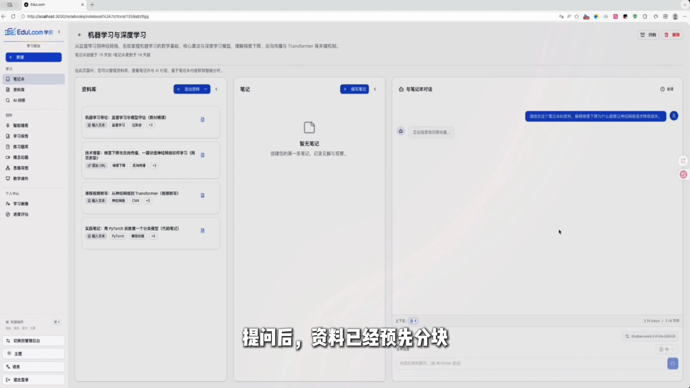
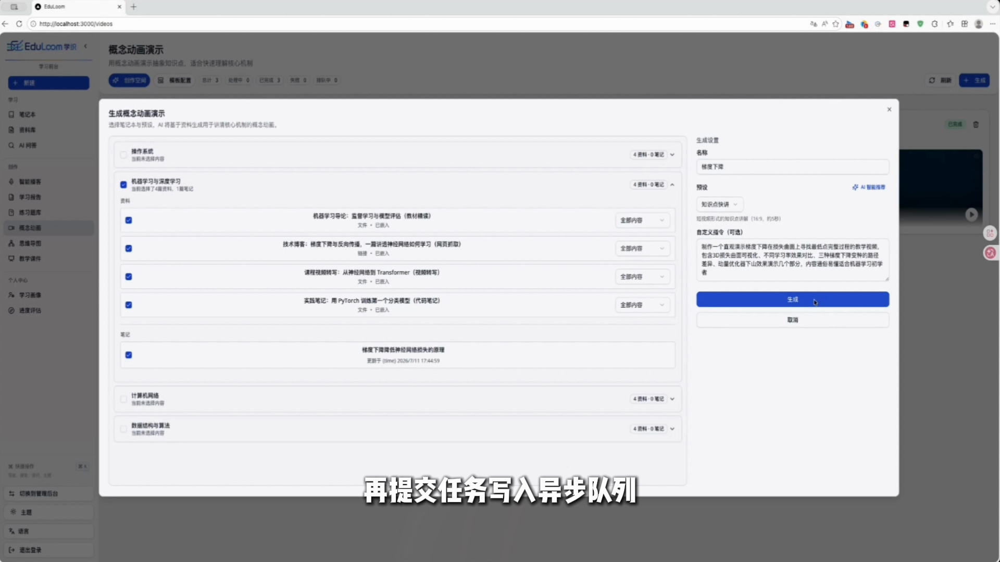
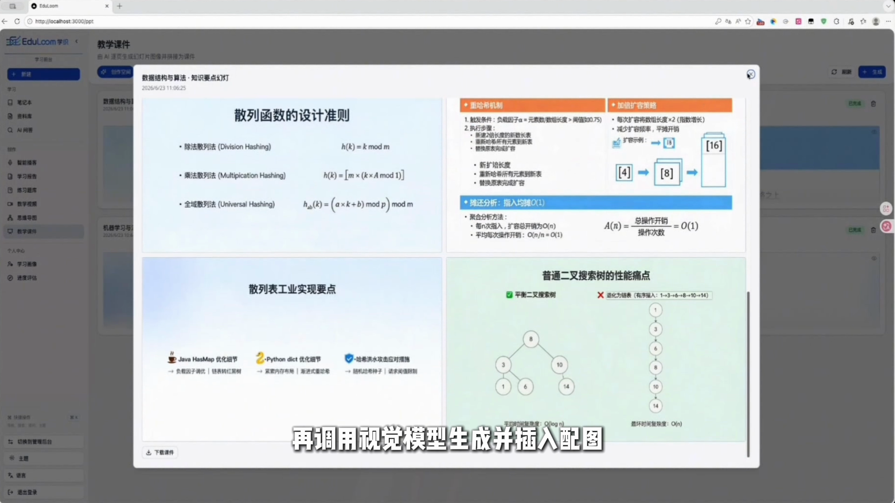
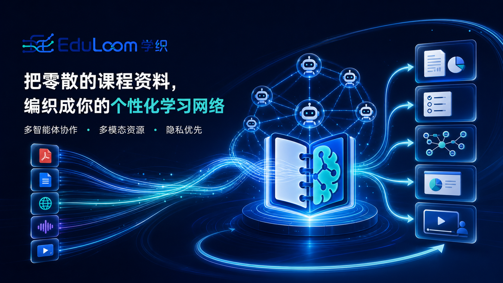

<p align="center">
  
</p>

# EduLoom 学织

**面向自主学习者的个性化学习系统：从课程资料出发，结合学习画像安排内容、练习与下一步学习。**

上传一份教材，或整理一个想学的主题。EduLoom 把资料、问答、资源生成、学习路径和效果评估放在同一个工作台中，让学习过程能够接着上一次继续。

<p align="center">
  
</p>

[观看演示](docs/project-introduction/EduLoom-demo.mp4) · [项目介绍](docs/project-introduction/EduLoom-project-introduction.docx) · [核心设计](#核心设计) · [本地运行](#本地运行)

## 一次学习如何展开

1. **建立画像。** 从对话中整理已有基础、认知方式、学习偏好、知识缺口、易错点与学习进度，支持后续增删和修正。
2. **组织资源。** 围绕资料生成讲解、题库、思维导图、课件和教学视频，也可以在学习中请求辅导。
3. **安排顺序。** 路径规划先确定学习步骤，再匹配资源库中的真实内容；缺少的资源单独标出。
4. **回看效果。** 结合路径进度与练习内容生成评估，查看薄弱项，并据此调整画像和后续学习安排。

<table>
  <tr>
    <td width="50%"></td>
    <td width="50%"></td>
  </tr>
  <tr>
    <td align="center">按资料和学习要求生成内容</td>
    <td align="center">生成结果在工作台内查看与复用</td>
  </tr>
</table>

截图取自项目演示录像。视频由 Git LFS 管理，下载方式见[演示文件说明](#演示文件)。

## 核心设计

### 以学习者为中心组织资料

项目提供资料管理、问答、学习者画像、资源推荐、路径规划、辅导和效果评估。画像可以持续修正，生成内容和路径规划都读取画像上下文。

这里的工程重点是把学习状态接入资源组织过程：同一份资料，可以根据学习者已有基础与薄弱项，采用不同的解释方式和学习顺序。

### 学习顺序与资源匹配分两步完成

`PathPlanner` 生成学习步骤，`ResourcePusher` 再把已存在的资源分配给各步骤。模型给出的资源 ID 会与实际加载的资源集合比对，无效 ID 被过滤，未匹配到资源的步骤保留缺口提示。

这道校验约束的是资源引用有效性；讲解内容与教学适用性仍需要用户判断。

### 将模型推理与执行控制分开

`LearningCoordinator` 负责准备上下文和调用 LangGraph 状态图，结果由服务层与任务处理器保存。问答链路把复杂问题拆成检索子任务，再汇总回答。

画像更新采用 `ADD / UPDATE / DELETE / NOOP` 操作，模型输出经过结构解析与字段校验。耗时生成进入异步任务队列；任务处理区分永久错误与瞬时错误，对可重试故障采用指数抖动退避。

## 代码导览

| 设计 | 实现入口 |
| --- | --- |
| 学习画像抽取与更新 | [profile_extraction.py](edu_loom/graphs/profile_extraction.py) |
| 两阶段规划与资源 ID 校验 | [path_planning.py](edu_loom/graphs/path_planning.py) |
| 角色名册与无状态协调器 | [coordinator.py](edu_loom/agents/coordinator.py) |
| 问题拆解、检索与回答汇总 | [ask.py](edu_loom/graphs/ask.py) |
| 学习任务与重试处理 | [learning_commands.py](commands/learning_commands.py) |
| 相关测试 | [路径规划](tests/test_path_planning.py)、[画像更新](tests/test_profile_extraction.py) |

前端使用 Next.js / React，服务端使用 FastAPI / LangGraph，SurrealDB 保存资料、画像、资源和向量数据。不同模型服务通过 Provider 接入。

## 本地运行

准备 Python 3.11 或 3.12、uv、Node.js / npm，以及已加入 PATH 的 SurrealDB。版本约束见 [pyproject.toml](pyproject.toml) 与 [前端依赖](frontend/package.json)。

```bash
git clone https://github.com/KingYeon-Zoo/EduLoom.git
cd EduLoom
cp .env.example .env
cd frontend
npm install
cd ..
./run-dev.sh
```

启动前按环境填写 `.env`。工作台地址为 `http://localhost:3000`，API 文档为 `http://localhost:5055/docs`。在线问答与生成需要配置对应服务商凭证；使用外部模型时，相关输入会发送给该服务商。

- [API 凭证配置](docs/3-USER-GUIDE/api-configuration.md)
- [模型服务配置](docs/5-CONFIGURATION/ai-providers.md)
- [OpenAI 兼容接口与本地模型接入](docs/5-CONFIGURATION/openai-compatible.md)

### 演示文件

可直接打开上方演示入口，或安装 Git LFS 后在仓库内下载视频：

```bash
git lfs pull --include="docs/project-introduction/EduLoom-demo.mp4"
```

演示中的课程资料与生成结果属于演示环境，新部署环境需自行导入资料与配置模型。

## 技术栈与许可

项目使用 LangGraph、FastAPI、Next.js、SurrealDB 等开源组件，模型生成由配置的服务商提供。许可证见 [LICENSE](LICENSE)。

## 宣传示意

下图为项目宣传素材，实际界面和运行范围以上方演示及代码说明为准。



### 预置媒体演示模式

默认播客与视频请求连接后端真实生成服务。只需展示预置媒体时，在前端构建环境设置 `NEXT_PUBLIC_DEMO_MODE=true` 并重新构建；该模式展示的媒体是预置内容。
